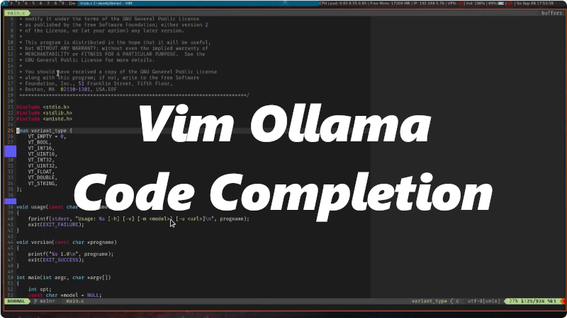
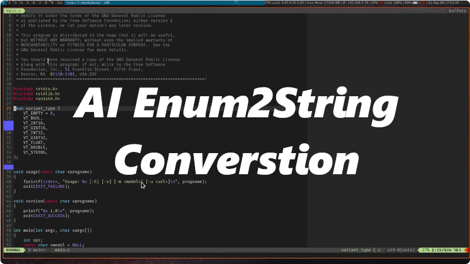
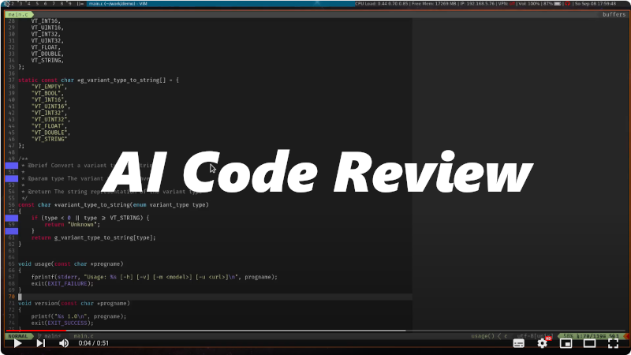
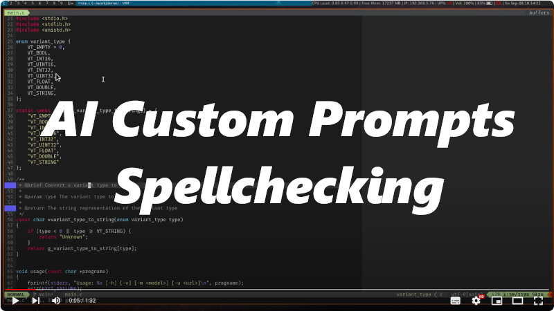

# Ollama Support for Vim

This plugin adds Copilot-like code completion support to Vim. It uses [Ollama](https://ollama.com) as a backend, which
can run locally and does not require cloud services, thus preserving your privacy.

## Motivation

[Copilot.vim](https://github.com/github/copilot.vim) by Tim Pope is an excellent plugin for both Vim and NeoVim.
However, it is limited to Microsoft's Copilot, a commercial cloud-based AI that requires sending all your data to
Microsoft.

With Ollama and freely available LLMs (e.g., Llama3, Codellama, Deepseek-coder-v2), you can achieve similar results
without relying on the cloud. While other plugins are available, they typically require NeoVim, which isn't an
alternative for me. I prefer using Vim in the terminal and do not want to switch to NeoVim for various reasons.

## Features

- Intelligent AI-based code completion
- Integrated chat support for code reviews and other interactions


## Screencasts

### Creating a C application with command line option parsing using AI

[](https://www.youtube.com/watch?v=zhahVd8ibRM)

### Creating Enum to String Conversion function using AI

[](https://www.youtube.com/watch?v=G-ivVUXCKQk)

### Code Review

[](https://www.youtube.com/watch?v=kLkFr4rbPUo)

### Custom Prompts - Spellcheck Example

[](https://www.youtube.com/watch?v=aWEQTktv6fs)

## How It Works

The plugin uses two Python scripts, `ollama.py` and `chat.py`, to communicate with Ollama via its REST API. The first
script handles code completion tasks, while the second script is used for interactive chat conversations. The Vim plugin
uses these scripts via I/O redirection to integrate AI results into Vim.

This plugin supports Vim only, not NeoVim. If you're looking for a NeoVim plugin, check out
[LLM](https://github.com/huggingface/llm.nvim).

## Installation

Install `gergap/vim-ollama` using vim-plug or any other plugin manager.

vim-plug example:
```vim
call plug#begin()
...
Plug 'gergap/vim-ollama'
call plug#end()
```

## Configuration

By default, the plugin uses Ollama on localhost. You can change this by adding the following variable to your `.vimrc`:

```vim
let g:ollama_host = 'http://tux:11434'
```

Next, configure the LLM models and the corresponding fill-in-the-middle (FIM) tokens. The variable `g:ollama_model`
defines the LLM for code completion tasks. This must be a model with fill-in-the-middle support; otherwise, code
completion may not work as expected. The variable `g:ollama_chat_model` is used for interactive conversations, similar
to ChatGPT.

Example configuration:

```vim
" Default chat model
let g:ollama_chat_model = 'llama3'

" Codellama models
let g:ollama_model = 'codellama:13b-code'
let g:ollama_model = 'codellama:7b-code'
let g:ollama_model = 'codellama:code'

" Codegemma (small and fast)
let g:ollama_model = 'codegemma:2b'
let g:ollama_fim_prefix = '<|fim_prefix|>'
let g:ollama_fim_middle = '<|fim_middle|>'
let g:ollama_fim_suffix = '<|fim_suffix|>'

" Deepseek-coder-v2
let g:ollama_model = 'deepseek-coder-v2:16b-lite-base-q4_0'
let g:ollama_fim_prefix = '<｜fim▁begin｜>'
let g:ollama_fim_suffix = '<｜fim▁hole｜>'
let g:ollama_fim_middle = '<｜fim▁end｜>'
```

| Variable              | Default                  | Description                            |
|-----------------------|--------------------------|----------------------------------------|
| `g:ollama_host`       | `http://localhost:11434` | The URL of the Ollama server.          |
| `g:ollama_chat_model` | `llama3`                 | The LLM for interactive conversations. |
| `g:ollama_model`      | `codellama:code`         | The LLM for code completions.          |
| `g:ollama_fim_prefix` | `<PRE> `                 | FIM prefix for Codellama.              |
| `g:ollama_fim_middle` | ` <MID>`                 | FIM middle for Codellama.              |
| `g:ollama_fim_suffix` | ` <SUF>`                 | FIM suffix for Codellama.              |

When changing the code completion model, consult the model’s documentation to find the correct FIM tokens.

## Usage

Simply start coding. The completions will appear as "ghost text" and can be accepted by pressing `<tab>`. To ignore
them, just continue typing or press `<C-]>` to dismiss the suggestion.

See `:help vim-ollama` for more information.
